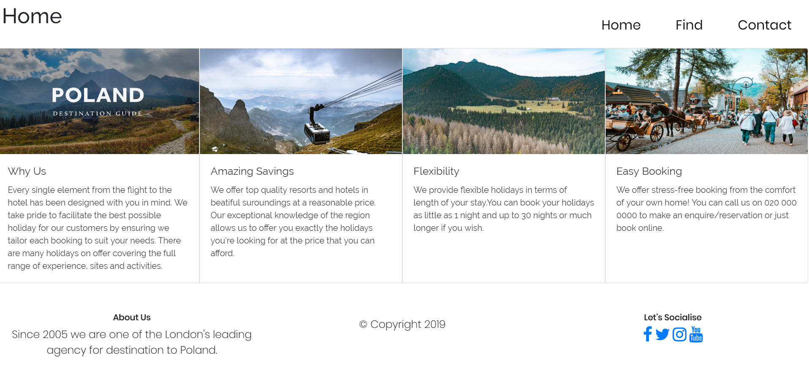
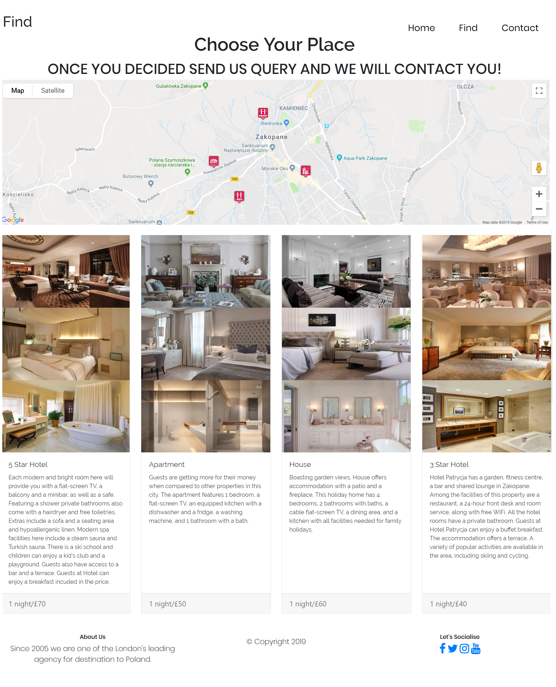
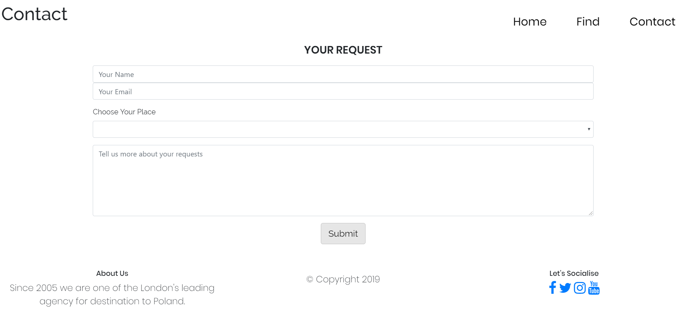

<h1 align='center'>
Interactive Frontend - Milestone Project 2 -Destination Poland - Marzena Chodnicka
</h1>

<div align='center'>

[Destination Poland](https://marzdell.github.io/spa/) is a company helping people find perfect place if they would like to visit Poland, they help to organise your stay in.
It is for every age, pocket or amount of people. They offer stay in in hotel, apartment or house. Everyone can find something good for them.
<br><br>
[**View Destination Poland website here**](https://marzdell.github.io/spa/), 
[**View Website Development in new platform Cloud 9 here**](https://us-east-1.console.aws.amazon.com/cloud9/ide/1e70be28b943475e814a2acd4e968f2c)
 </div>
 
 ## Contents Table

1. [**UX**](#ux)
    - [**Project Purpose**](#project-purpose)
    - [**Design**](#design)
    - [**Wireframes**](#wireframes)

2. [**Features**](#features)
    - [**Existing Features**](#existing-features)
    - [**Features to Implement**](#features-to-implement)

3. [**Technologies Used**](#technologies-used)

4. [**Testing**](#testing)

5. [**Deployment**](#deployment)

6. [**Credits**](#credits)
    - [**Contents**](#contents)
    - [**Images**](#images)
    - [**Help with code**](#help-with-code)
    - [**Acknowledgements**](#acknowledgements)


## UX

### Project Purpose

The main goal of the Destination Poland is to help find perfect stay in Poland for customers of all ages.

### Design

The design of the page is minimalism and easy to move around the pages which help with good experience.

- #### Fonts

    - The fonts **'Raleway'**, **'Poppins'** were chosen as they simple and easy to read as well it is fitts to theme of my page to keep minimalism around the design.
    

- #### Colours

    - **All Pages -** A white background was chosen to keep simplicity and good looking design.
    
    - **Social links -** A blue color was chosen as a good contrast between background and links.
    
    - **Icons on the Map -** Icons were changed on the map to make easier for the user to see where each place is. As well I add **click** function with contents to be available to users.
    
    - **All Pages -** A white background with black text was chosen to keep minimalism and ensure that is easily displayed for all age of our users.
    
    - **Links -** A red colour has been chosen once hoverring on each link which make nice contrast between the background and links.
    
    - **Submit Button -**A delicate grey colour was choosen to make soft accent on the **Contact Page**, as well hoverring on the button will change on red which matching the 
    link settings.
    
    - **Pictures -** All theme of pictures are the same which make nice and good connection between the pages.
    
   
- #### Styling

    Styles of the each page was choosen to match all, that the user changing the page from one to another willl see the connection as well as pictures.
    I tried to keep minimalism and do not add too much content on pages as some of the users may leave the page due too overloaded pages.
    As well my styling fits to every age of the users as it is simple and tidy.

    
- #### Images

    All images have been choosen to match and have been downloaded from pinteres. 
    
### Wireframes

Wireframes were made using [Balsamiq](https://balsamiq.com/).

- #### Desktop Wireframes

    - [Main - Desktop Display](wireframes/desktop/main-desktop-display.png) 
    - [Find Page](wireframes/desktop/Find-page-desktop-display.png)
    - [Contact Page](wireframes/desktop/contact-page-desktop-display.png)
    
- #### Tablet Wireframes

    - [Main - Tablet Display](wireframes/tablet/main-tablet-display.png)
    - [Find Page - Tablet Display](wireframes/tablet/contact-page-tablet-display.png)
    - [Contact Page - Tablet Display](wireframes/contact-page-tablet-display.png)

- #### Mobile Wireframes

    - [Main - Mobile Display](assets/wireframes/tablet/main-mobile-display.png)
    - [Find Page - Mobile Display](assets/wireframes/tablet/find-page-mobile-display.png)
    - [Contact Page - Mobile Display](assets/wireframes/tablet/contact-page-mobile-display.png)

## Features

### Existing Features

1. #### Home Page 

    -*Home Page* describes how the *Destination Poland* company help with finding the place.
    
    -User can acknowledge with the benefits which *Destination Poland* can offer.
    
    
    <br>
    
    
    <br><br>
    
2. #### Find Page 

    -User can use map to see the accommodation of each place
    
    -User by scrolling on map can see all restaurants, shops and any activities around the rented place or touristic places.
    
    -Each place had small description and pictures added as well as price per night which can help them calculate price of rented place.
    
    
    <br>
    <div align="center">  
    
    </div><br><br>    
    
    
3. #### 'Contact Page'

    - It is form that user can fill up with option that he/she can choose. User has option to describe special request, add any question or any other requirments. 
    
        **The form contian:**
        
        - **Name** -User can write her/his name.
        - **Email** - User can put her/his email, it is required to write valid email
        - **Options** - User can choose option from the list.
        - **Text Area** -User can write message and describe all question which they would like to be emailed back to her/him.
    
    <br>
    <div align="center">  
    
    </div><br><br>


### Features to Implement

1. #### Find Page

    -Adding new cities and areas in Poland for traveling.
    -Displaying pictures of the accommodation as a carousel connected with Javascript.
    -Adding icons in description, which would show if the accommodation has any needed requirements (example: WiFi, Tv, Pool and itc), this could help users
    choose what they would like to have

2. #### New Page *Feedbacks and Help*

    -Adding feature that can allow users leaves any feedbacks about the company or one of the accommodation. 
    
    -Fast communication between the user which choose one of the options and helpdesk.
    
3. #### Contact Page

    - A feature that will allow user send seperate request if they would like the company to find their own place which is not in options.

  
## Technologies Used

- This project uses HTML, CSS, JavaScript and various different technologies to work as helpers to the languages.
- #### [New Cloud9](https://www.vocareum.com)
    - **Cloud9** is an IDE used to develop the website.
- #### [Bootstrap](https://www.bootstrapcdn.com/)
    - **Bootstrap** is used to create easier & cleaner responsiveness in addition with helping maintain padding and margins.
    - It's also used to include modal features to the website to give it a professional look.
- #### [Google Fonts](https://fonts.google.com/)
    - **Google Fonts** has been used to provide clean and eye-catching fonts to the website.
- #### [JQuery](https://jquery.com)
    - **JQuery** has been used to simplify DOM manipulation.
- #### [Font Awesome](https://www.bootstrapcdn.com/fontawesome/)
    - **Font Awesome** has been used to add icons to the website.
- #### [GitHub](https://github.com/)
    - **Github** is used: 
    1. As a remote backup of code used in the project.
    2. As a remote server for another user to see the code used in the project.
    3. For users to view the deployed version of the website. The deployed version can be viewed [here!](https://marzdell.github.io/spa/).


## Testing

<h1 align="center">
Destination Poland - Testing
</h1>

## Automated Testing

### Validating Code

Validation services were used to ensure that code was valid code used to develop the website.

- [W3C Markup Validation Service](https://validator.w3.org/) was used to test HTML code to ensure it was valid code.
- [W3C CSS Validation Service](https://jigsaw.w3.org/css-validator/) was used to test CSS code to ensure it was valid code.
- [Code Beautify JavaScript Validator](https://codebeautify.org/jsvalidate) was used to test JavaScript code to ensure it was valid code.


## Manual Testing

A number of manual tests were done to ensure the website is working as it should be and that the user can use without any problems.

### Testing on Desktop

The website was tested in Browsers: Chrome, Safari, FireFox and Internet Explorer. 
The website was tested and used on a Laptop, Macbook & Desktop PC and Iphone and Samsung Galaxy.

### Testing on tablet and mobile devices

The website was tested on iPhone 6, Samsung Galaxy. It's also been run through Chrome Developer tools
in the 'Responsive' setting.

## Testing:
 I checked that:
 
 -All the links are working correctly and the page is not showing any error.
 -Map is displayed in good size and user can scroll without any issue.
 -Form is connected to Emailjs and it is sending without error.


## Deployment

The project was built using [New Cloud9](https://www.vocareum.com), through a built-in function called 'Git', I could commit
the project & push it up to [GitHub](https://github.com/).

- To view the deployed version of [Destination Poland](https://marzdell.github.io/spa/) I needed to take the following steps:
    - Log in to [GitHub](https://github.com/).
    - Select **MarzDell/spa** from the list of repositories.
    - Select **Settings** from the navbar near the top of the page.
    - Scroll down to where it says **Github Pages**, there is a subtitle labelled **Source**, click that and change the source to be **master branch**.
    - The page is automatically refreshed and ready for deployment, it can take up to 5-10 minutes for it to be viewable.

- To add this repository to your local workspace:
    - Click on the [spa repository on GitHub!](https://marzdell.github.io/spa/) link.
    - Select the green button on the right-hand side named **Clone or download** and copy the clone URL.
    - Go into your local workspace and open up a new terminal (git bash).
    - You will need to be inside of the directory that you want to add the cloning to.
    - Type `git clone ` and paste the URL you copied from GitHub and press enter. It should look like this: 
```console
git clone https://github.com/*username*/*repository*
```
The process of cloning will now be completed.


## Credits

### Contents

- All Content has been thought of and written by the Developer. 


### Images

-Images were downloaded from the webpage [Pinterest](https://www.pinterest.co.uk/).
  

### Help with code

- Ideas on how to get started with the Javascript for map I took from: [Traversy Media](https://www.youtube.com/channel/UC29ju8bIPH5as8OGnQzwJyA).
- I used as well help from [Google Developer](https://developers.google.com/).
- To create my websites I used help from [Bootstrap](https://getbootstrap.com/), [stackoverflow](https://stackoverflow.com/),[w3schools](https://www.w3schools.com).
- To add Latitude, Longitude I used [lat-lng](https://lat-lng.net/)


### Acknowledgements

- Spencer Barriball (spence_mentor) - For discussing ideas, providing help with project and any ideas related to the project. 
    As well offering me help outside of mentor session if I will need anything or if i will occure issue that I cannot solve by myself.

- Website about minimalism- [becomingminimalist](https://www.becomingminimalist.com/) 


